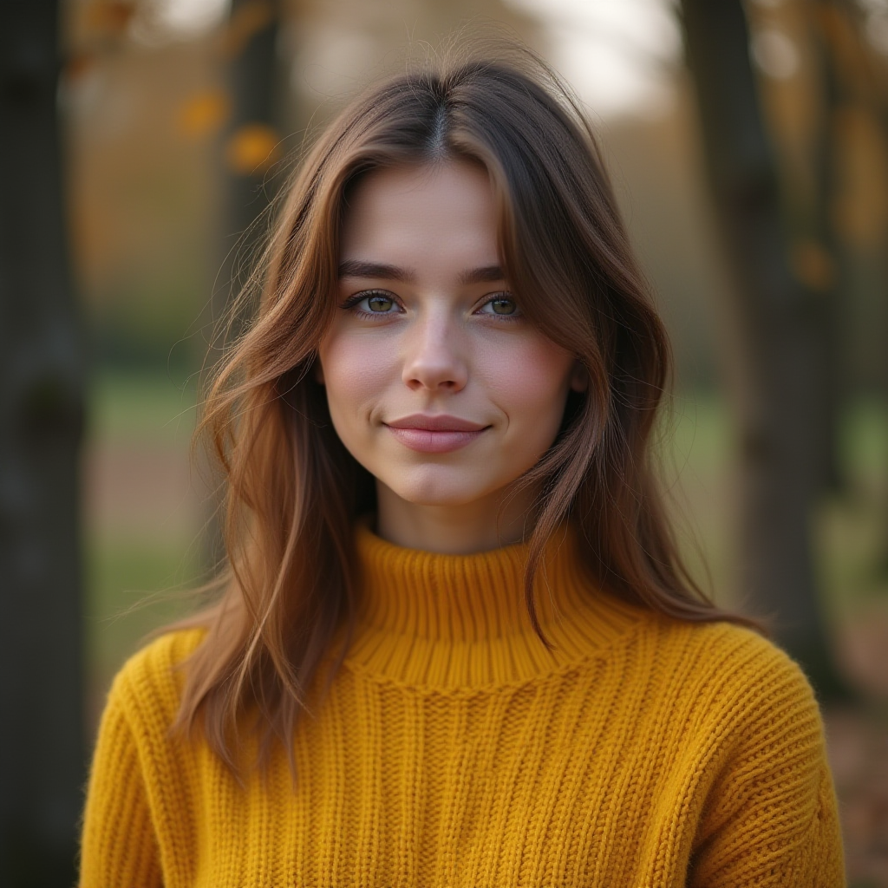
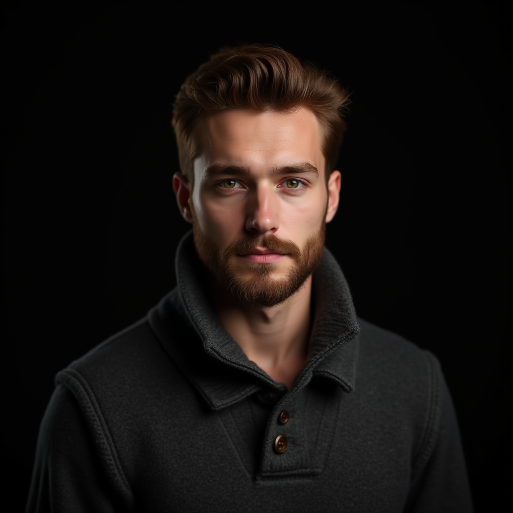
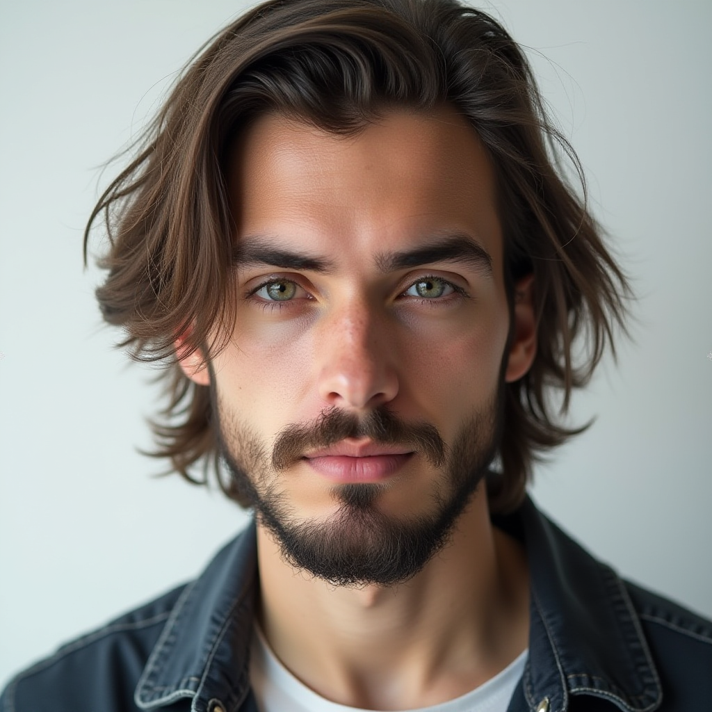
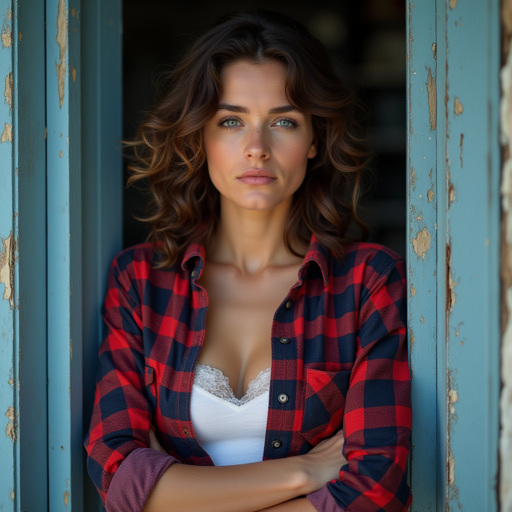
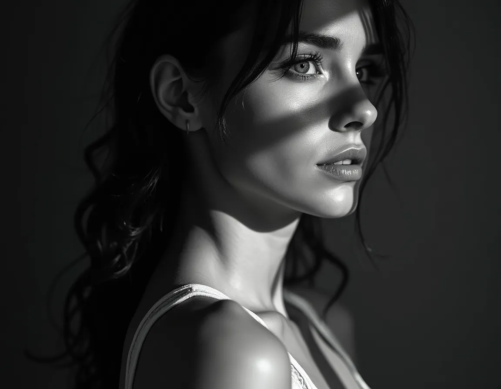
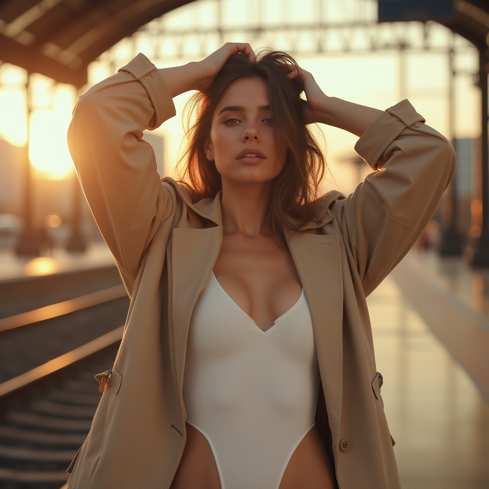
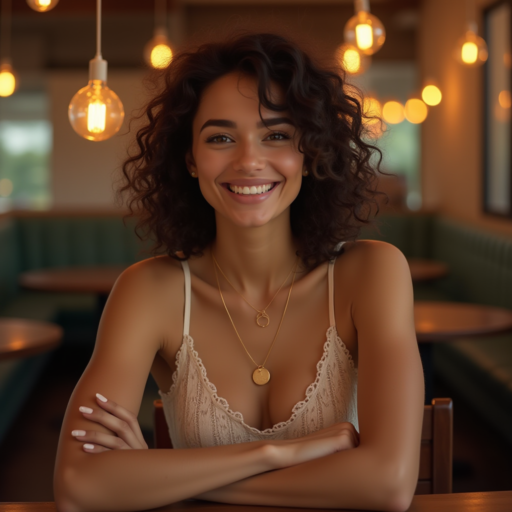
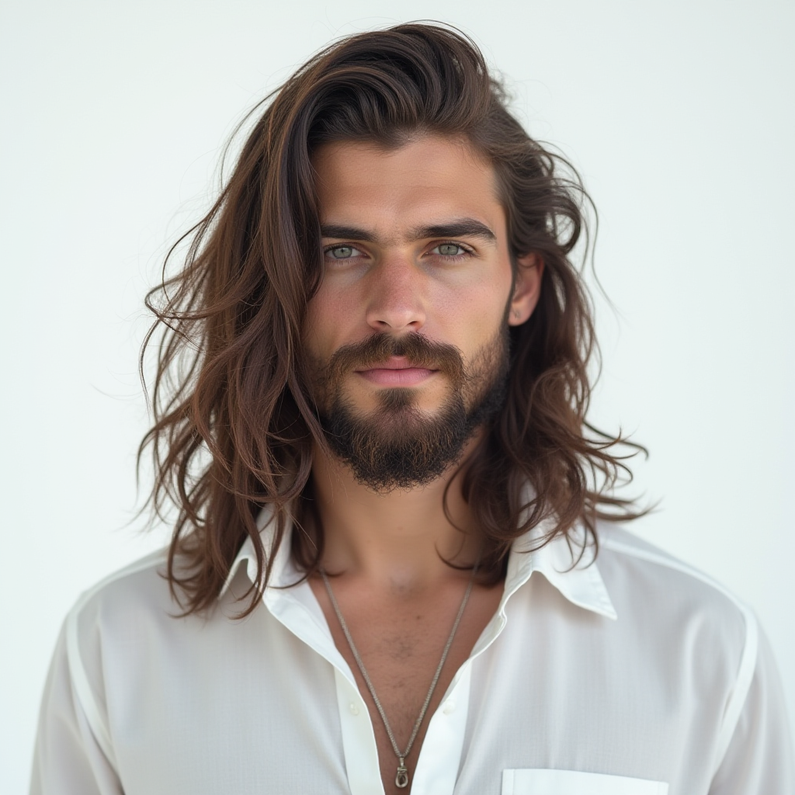
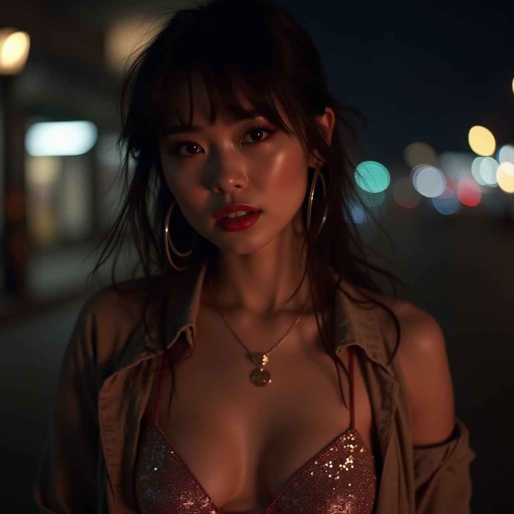

Check out the configuration reference at https://huggingface.co/docs/hub/spaces-config-reference

## Clone the Repo by 

    # Make sure you have git-lfs installed (https://git-lfs.com)
    git lfs install
    
    git clone https://huggingface.co/spaces/prithivMLmods/FLUX-REALISM
    
    # If you want to clone without large files - just their pointers
    
    GIT_LFS_SKIP_SMUDGE=1 git clone https://huggingface.co/spaces/prithivMLmods/FLUX-REALISM

 ## Image Gallery

|  |  |  |
|--------------------------|--------------------------|--------------------------|
|  |  |  |
|  |  |  |

# Canopus-LoRA-Flux-FaceRealism

The demo is here : https://huggingface.co/spaces/prithivMLmods/FLUX-REALISM

**The model is still in the training phase. This is not the final version and may contain artifacts and perform poorly in some cases.**

## Model description 

**prithivMLmods/Canopus-LoRA-Flux-FaceRealism**

Image Processing Parameters 

| Parameter                 | Value  | Parameter                 | Value  |
|---------------------------|--------|---------------------------|--------|
| LR Scheduler              | constant | Noise Offset              | 0.03   |
| Optimizer                 | AdamW  | Multires Noise Discount   | 0.1    |
| Network Dim               | 64     | Multires Noise Iterations | 10     |
| Network Alpha             | 32     | Repeat & Steps           | 30 & 3000+ |
| Epoch                     | 20     | Save Every N Epochs       | 1      |

& More ....

## Trigger prompts

      A portrait of an attractive woman in her late twenties with light brown hair and purple, wearing large a a yellow sweater. She is looking directly at the camera, standing outdoors near trees.. --ar 128:85 --v 6.0 --style raw

      
      Headshot of handsome young man, wearing dark gray sweater with buttons and big shawl collar, brown hair and short beard, serious look on his face, black background, soft studio lighting, portrait photography --ar 85:128 --v 6.0 --style raw
      
      
      A photo of the model wearing a white bodysuit and beige trench coat, posing in front of a train station with hands on head, soft light, sunset, fashion photography, high resolution, 35mm lens, f/22, natural lighting, global illumination. --ar 85:128 --v 6.0 --style raw
      
      
      An image of a woman with fair skin and natural, wavy hair styled in soft curls around her face. She has defined eyebrows and light-colored eyes that draw attention. She's dressed in a red and navy plaid shirt with the top unbuttoned to show a white undershirt, and the sleeves rolled up to the forearms. The woman is casually leaning against a weathered blue door frame with peeling paint, adding a rustic charm to the scene. Her arms are crossed or resting in front of her, and she has a soft, contemplative expression on her face.
      
      
      A black and white photo of a woman with shadow., in the style of minimalist beauty, light bronze and bronze, serene faces, sharp edges, karencore, high definition, contrast shading, realism --ar 3:5 --stylize 750 --v 6.0 --style raw
      
      
      Photograph, face, young man professional model, minimalist, stylish nessy long hairstyle, beard, profound gaze, Canon EOS R5 with an RF 85mm F1.2L lens, solid white environment, studio lights setting, ultra-realistic, 32K UHD --ar 9:16 --style raw --stylize 700

| Parameter       | Value                                                                                 |
|-----------------|---------------------------------------------------------------------------------------|
| Prompt          |  Photograph, face, young man professional model, minimalist, stylish nessy long hairstyle, beard, profound gaze, Canon EOS R5 with an RF 85mm F1.2L lens, solid white environment, studio lights setting, ultra-realistic, 32K UHD --ar 9:16 --style raw --stylize 700 |
| Sampler         | euler                                                                                 |

## Trigger words

You should use `face` to trigger the image generation.

You should use `realism` to trigger the image generation.

You should use `face realism` to trigger the image generation.

## Download model

Weights for this model are available in Safetensors format.

[Download](/prithivMLmods/Canopus-LoRA-Flux-FaceRealism/tree/main) them in the Files & versions tab.

.

.

.🤗: hf.co/prithivmlmods
